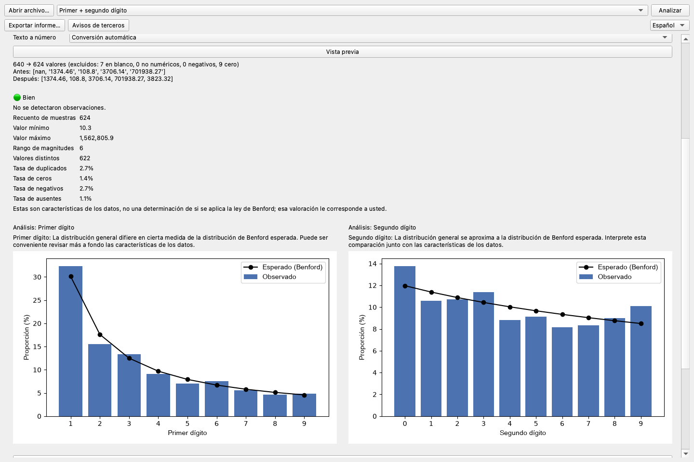
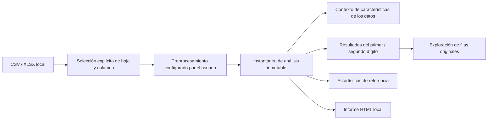

# Benford Lens

[한국어](README.ko.md) · [English](README.md) · [简体中文](README.zh.md) ·
[日本語](README.ja.md) · [Français](README.fr.md) · **Español** ·
[Русский](README.ru.md)


Benford Lens es una aplicación de escritorio que prioriza el procesamiento local y permite a
personas no especializadas explorar las distribuciones del primer y segundo dígito en datos CSV
y Excel. Los archivos permanecen en el equipo del usuario, y todas las decisiones importantes —
desde la hoja y la columna hasta el preprocesamiento y el modo de análisis— son explícitas.



## Por qué existe este proyecto

El análisis de Benford es fácil de presentar como una fórmula, pero mucho más difícil de convertir
en un producto responsable y fácil de usar. Una herramienta práctica debe ayudar a comprender las
características de los datos sin decidir automáticamente si se aplica la ley de Benford, conservar
el vínculo entre cada gráfico y las filas originales, y mantener los conjuntos de datos
potencialmente sensibles fuera de los servicios remotos.

Benford Lens resuelve este problema con un flujo de escritorio completo: carga local de archivos,
preprocesamiento controlado por el usuario, análisis por posición, estadísticas explicativas,
exploración de filas originales y exportación de informes.

## Funciones principales

- Cargar archivos CSV y XLSX localmente, con selección explícita de hoja y columna.
- Previsualizar el tratamiento elegido para valores vacíos, ceros, negativos, duplicados,
  decimales y números almacenados como texto.
- Comparar las distribuciones observadas y esperadas del primer dígito, el segundo o ambos.
- Revisar características orientativas de los datos sin un veredicto automático de aplicabilidad.
- Mostrar bajo demanda estadísticas de referencia MAD, chi-cuadrado, KS y tamaño de muestra.
- Hacer clic en un dígito del gráfico para revisar, buscar y exportar las filas originales correspondientes.
- Exportar localmente un informe HTML autónomo.
- Cambiar entre interfaces en inglés, coreano, chino, japonés, español, francés y ruso.

La captura anterior se obtuvo de la aplicación real con datos sintéticos deterministas.

## Descarga

Descarga los paquetes actuales para Windows x64 y macOS Apple Silicon desde
[GitHub Releases](https://github.com/internalforces/BenfordLens/releases/latest).

- **Windows:** elige el MSI por usuario para una instalación estándar o el ZIP para uso portátil.
- **macOS:** elige el ZIP arm64 para equipos Mac con Apple Silicon.

Los paquetes descargables no están firmados actualmente con certificados de plataforma de pago.
Windows puede mostrar una advertencia de SmartScreen o impedir la ejecución mediante Smart App
Control; macOS puede requerir **Privacidad y seguridad → Abrir igualmente**. Antes de ejecutar un
paquete, revisa el aviso de seguridad y verifica la suma SHA-256 correspondiente en la página de
la Release.

## Resultados de ingeniería

| Área | Resultado |
|------|-----------|
| Calidad automatizada | Ruff, la comprobación de formato, mypy sobre 22 archivos fuente y las 258 pruebas pasan en la base actual |
| Rendimiento | Eliminar la extracción repetida de dígitos mejoró entre un 30,0 y un 31,8 % el benchmark registrado del controlador con 100 000 filas |
| Coherencia del estado | El análisis combinado preprocesa una sola vez y guarda resultados, estadísticas, contexto de aplicabilidad y correspondencias de filas en una instantánea inmutable |
| Internacionalización | Seis catálogos Qt completos además del inglés integrado, con pruebas de paridad de catálogos y regresión de la interfaz real |
| Robustez de escritorio | Cobertura de diseños compactos/anchos, fuentes CJK, etiquetas rusas largas y desplazamiento con rueda sobre los gráficos |
| Empaquetado | Candidato verificado para macOS arm64, además de candidatos ZIP de Windows x64 y MSI por usuario |

Las cifras de rendimiento son mediciones comparativas de desarrollo, no garantías para todos los
equipos. La medición anterior de cobertura del 95,00 % pertenece a la base M3 registrada; este
README no la presenta como cobertura actual.

## Resumen de la arquitectura



La interfaz PySide6 delega el estado del flujo de trabajo en un controlador independiente del
framework. La capa de análisis usa Pandas, NumPy y SciPy sin importar PySide6, por lo que el
comportamiento estadístico puede probarse con independencia de la interfaz de escritorio. Ningún
componente requiere una base de datos ni un servidor de aplicaciones.

Consulta la [guía de arquitectura](docs/architecture.md) para conocer los límites de los
componentes y las decisiones de diseño.

## Ejecutar desde el código fuente

Requisitos: Python 3.11 y [uv](https://docs.astral.sh/uv/).

```bash
uv sync --locked --group dev
uv run benford-lens
```

El archivo de origen seleccionado se abre en modo de solo lectura. Benford Lens solo escribe un
archivo CSV o HTML cuando el usuario elige explícitamente un destino de exportación distinto.

## Verificar el proyecto

```bash
uv run ruff check .
uv run ruff format --check src/ tests/ scripts/
uv run mypy src/
QT_QPA_PLATFORM=offscreen uv run pytest
```

El resultado verificado actual es de 258 pruebas superadas. Consulta la
[guía de verificación](docs/verification.md) para ver la matriz de pruebas, el método de medición
del rendimiento, las comprobaciones de empaquetado y los límites explícitos de la verificación.

## Estado del empaquetado y la publicación

- **macOS:** el flujo de publicación crea y verifica un ZIP de PyInstaller para Apple Silicon.
  Quedan pendientes la firma Developer ID, la notarización y la verificación en un equipo limpio.
- **Windows:** el flujo de publicación crea y verifica un ZIP de PyInstaller x64 y un MSI por
  usuario con WiX 5.0.2. Quedan pendientes la firma Authenticode y la verificación en un equipo limpio.
- **Linux:** existe una configuración de PyInstaller, pero aún no se ha creado ni verificado en un destino Linux.
- **Distribución:** las etiquetas de versión solo publican los paquetes verificados sin firma y sus
  archivos SHA-256 mediante GitHub Releases después de que ambos trabajos de plataforma terminen correctamente.

## Documentación

- [Caso de estudio del portafolio](docs/portfolio-case-study.md) — restricciones del producto,
  decisiones técnicas clave, resultados medidos y retrospectiva
- [Arquitectura](docs/architecture.md) — capas, flujo de datos, modelo de estado y límite de privacidad
- [Verificación](docs/verification.md) — pruebas automatizadas, evidencia de rendimiento y comprobaciones de publicación
- [Guía de usuario](docs/user-guide.md) — carga, preprocesamiento, análisis, exploración y exportación

La evidencia detallada del desarrollo se conserva en `memory/`, `tasks/` y `reports/`. Los cuatro
documentos anteriores forman intencionadamente una ruta pública de lectura reducida.

## Comunidad y avisos

- [Guía de contribución](CONTRIBUTING.md) — entorno de desarrollo, límites del proyecto y Pull Requests
- [Soporte](SUPPORT.md) — ayuda de uso, alcance compatible y reproducciones sintéticas seguras
- [Política de seguridad](SECURITY.md) — comunicación privada de problemas de seguridad y versiones compatibles
- [Código de conducta](CODE_OF_CONDUCT.md) — participación respetuosa y comunicaciones privadas
- [Avisos de terceros](THIRD_PARTY_NOTICES.md) — inventario exacto del entorno de ejecución,
  licencias, fuentes, atribuciones e instrucciones de reenlace de Qt

## Privacidad y límites de interpretación

- Los datos se procesan localmente y en memoria; no hay inicio de sesión, telemetría, análisis en
  la nube ni ruta de carga en línea.
- La aplicación nunca modifica el archivo CSV/XLSX original.
- Benford Lens describe distribuciones y características de los datos. No decide si la ley de
  Benford se aplica a un conjunto de datos; esa valoración corresponde al usuario.

## Licencia

Benford Lens está disponible bajo la [licencia MIT](LICENSE). Los componentes de terceros siguen
sujetos a sus términos correspondientes, documentados en los
[avisos de terceros](THIRD_PARTY_NOTICES.md).
