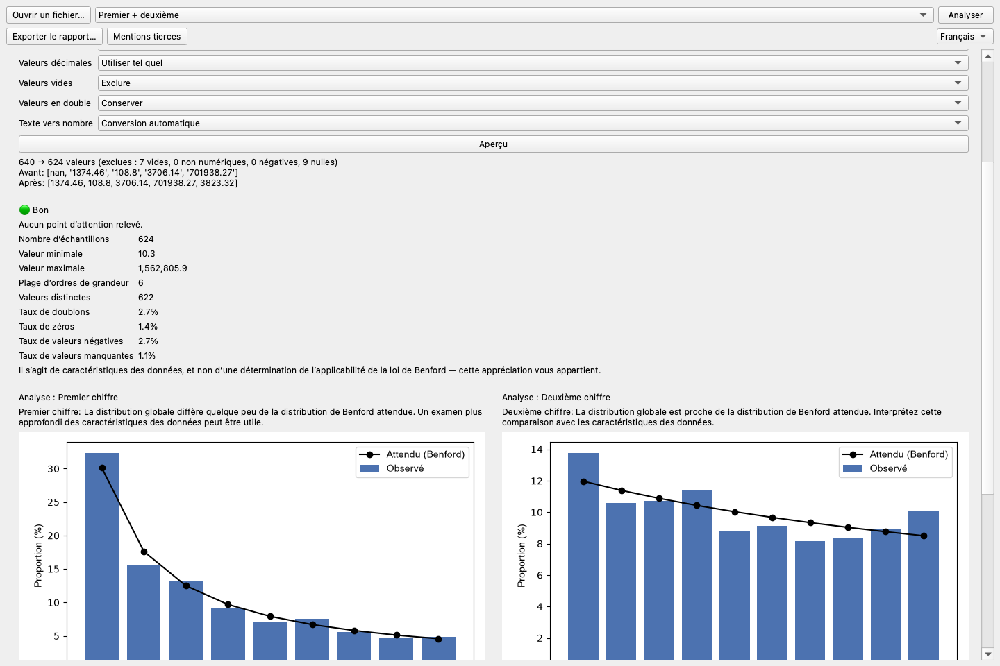
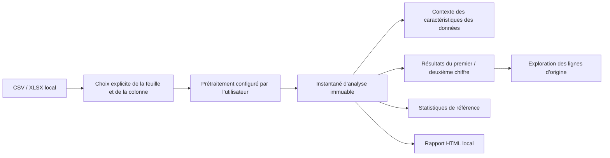

# Benford Lens

[한국어](README.ko.md) · [English](README.md) · [简体中文](README.zh.md) ·
[日本語](README.ja.md) · **Français** · [Español](README.es.md) ·
[Русский](README.ru.md)


Benford Lens est une application de bureau privilégiant le traitement local. Elle permet aux
non-spécialistes d’explorer la distribution du premier et du deuxième chiffre dans des données
CSV et Excel. Les fichiers restent sur l’ordinateur de l’utilisateur et chaque choix important —
feuille, colonne, prétraitement et mode d’analyse — demeure explicite.



## Pourquoi ce projet

L’analyse de Benford est facile à présenter sous forme de formule, mais bien plus difficile à
transformer en produit responsable et utilisable. Un outil pratique doit aider à comprendre les
caractéristiques des données sans décider automatiquement si la loi de Benford s’applique,
préserver le lien entre chaque graphique et les lignes d’origine, et garder les jeux de données
potentiellement sensibles hors des services distants.

Benford Lens répond à ce besoin avec un flux de travail complet : chargement local, prétraitement
contrôlé par l’utilisateur, analyse par position, statistiques explicatives, exploration des
lignes d’origine et export de rapport.

## Fonctionnalités principales

- Charger localement des fichiers CSV et XLSX, puis choisir explicitement la feuille et la colonne.
- Prévisualiser le traitement choisi pour les valeurs vides, nulles, négatives, dupliquées,
  décimales et numériques au format texte.
- Comparer les distributions observées et attendues du premier chiffre, du deuxième chiffre ou
  des deux simultanément.
- Examiner des caractéristiques indicatives des données sans verdict automatique d’applicabilité.
- Afficher à la demande les statistiques de référence MAD, khi-deux, KS et taille d’échantillon.
- Cliquer sur un chiffre du graphique pour examiner, rechercher et exporter les lignes d’origine.
- Exporter localement un rapport HTML autonome.
- Basculer entre les interfaces anglaise, coréenne, chinoise, japonaise, espagnole, française et russe.

La capture ci-dessus provient de l’application réelle avec des données synthétiques déterministes.

## Téléchargement

Téléchargez les versions actuelles pour Windows x64 et macOS Apple Silicon depuis
[GitHub Releases](https://github.com/internalforces/BenfordLens/releases/latest).

- **Windows :** choisissez le MSI par utilisateur pour une installation classique ou le ZIP
  pour une utilisation portable.
- **macOS :** choisissez le ZIP arm64 pour les Mac Apple Silicon.

Les paquets disponibles ne sont actuellement pas signés avec des certificats de plateforme
payants. Windows peut afficher un avertissement SmartScreen ou bloquer l’application avec Smart
App Control. Sous macOS, il peut être nécessaire d’utiliser **Confidentialité et sécurité →
Ouvrir quand même**. Avant l’exécution, consultez l’avis de sécurité et vérifiez la somme SHA-256
correspondante sur la page de la Release.

## Résultats d’ingénierie

| Domaine | Résultat |
|---------|----------|
| Qualité automatisée | Ruff, le contrôle du formatage, mypy sur 22 fichiers source et les 258 tests réussissent sur la base actuelle |
| Performances | La suppression de l’extraction répétée des chiffres a amélioré de 30,0 à 31,8 % le benchmark enregistré du contrôleur sur 100 000 lignes |
| Cohérence de l’état | L’analyse combinée ne prétraite qu’une fois et conserve résultats, statistiques, contexte d’applicabilité et correspondances de lignes dans un instantané immuable |
| Internationalisation | Six catalogues Qt complets en plus de l’anglais intégré, avec tests de parité des catalogues et de l’interface réelle |
| Robustesse du bureau | Couverture des dispositions compactes/larges, polices CJK, libellés russes longs et défilement à la molette sur les graphiques |
| Paquetage | Candidat macOS arm64 vérifié, ainsi que candidats ZIP Windows x64 et MSI par utilisateur |

Les chiffres de performance sont des mesures comparatives de développement, et non des garanties
pour toutes les machines. La mesure de couverture antérieure de 95,00 % appartient à la base M3
enregistrée ; ce README ne la présente pas comme la couverture actuelle.

## Vue d’ensemble de l’architecture



L’interface PySide6 délègue l’état du flux de travail à un contrôleur indépendant du framework.
La couche d’analyse utilise Pandas, NumPy et SciPy sans importer PySide6 ; le comportement
statistique peut donc être testé indépendamment de l’interface de bureau. Aucun composant ne
nécessite de base de données ni de serveur d’application.

Consultez le [guide d’architecture](docs/architecture.md) pour les limites des composants et les
choix de conception.

## Exécuter depuis les sources

Prérequis : Python 3.11 et [uv](https://docs.astral.sh/uv/).

```bash
uv sync --locked --group dev
uv run benford-lens
```

Le fichier source sélectionné est ouvert en lecture seule. Benford Lens n’écrit un fichier CSV
ou HTML que lorsque l’utilisateur choisit explicitement une destination d’export distincte.

## Vérifier le projet

```bash
uv run ruff check .
uv run ruff format --check src/ tests/ scripts/
uv run mypy src/
QT_QPA_PLATFORM=offscreen uv run pytest
```

Le résultat actuellement vérifié est de 258 tests réussis. Consultez le
[guide de vérification](docs/verification.md) pour la matrice de tests, la méthode de mesure des
performances, les contrôles de paquetage et les limites explicites de la vérification.

## État du paquetage et de la publication

- **macOS :** le flux de publication construit et vérifie un ZIP PyInstaller pour Apple Silicon.
  La signature Developer ID, la notarisation et la vérification sur une machine vierge restent à faire.
- **Windows :** le flux de publication construit et vérifie un ZIP PyInstaller x64 et un MSI
  WiX 5.0.2 par utilisateur. La signature Authenticode et la vérification sur une machine vierge
  restent à faire.
- **Linux :** une configuration PyInstaller existe, mais elle n’a pas encore été construite ni
  vérifiée sur une cible Linux.
- **Distribution :** les balises de version ne publient les paquets non signés vérifiés et leurs
  fichiers SHA-256 via GitHub Releases qu’après la réussite des deux plateformes.

## Documentation

- [Étude de cas du portfolio](docs/portfolio-case-study.md) — contraintes du produit, décisions
  techniques clés, résultats mesurés et rétrospective
- [Architecture](docs/architecture.md) — couches, flux de données, modèle d’état et limite de confidentialité
- [Vérification](docs/verification.md) — tests automatisés, éléments de performance et contrôles de publication
- [Guide d’utilisation](docs/user-guide.md) — chargement, prétraitement, analyse, exploration et export

Les preuves de développement détaillées restent conservées dans `memory/`, `tasks/` et `reports/`.
Les quatre documents ci-dessus constituent volontairement un parcours public restreint.

## Communauté et mentions

- [Guide de contribution](CONTRIBUTING.md) — environnement de développement, limites du projet et Pull Requests
- [Assistance](SUPPORT.md) — aide à l’utilisation, périmètre pris en charge et reproductions synthétiques sûres
- [Politique de sécurité](SECURITY.md) — signalement privé des problèmes de sécurité et versions prises en charge
- [Code de conduite](CODE_OF_CONDUCT.md) — participation respectueuse et signalements privés
- [Mentions tierces](THIRD_PARTY_NOTICES.md) — inventaire exact de l’environnement d’exécution,
  licences, sources, attributions et instructions de réédition de liens Qt

## Confidentialité et limites d’interprétation

- Les données sont traitées localement et en mémoire ; il n’existe aucun compte, aucune télémétrie,
  aucune analyse dans le cloud et aucun chemin de téléversement en ligne.
- L’application ne modifie jamais le fichier CSV/XLSX d’origine.
- Benford Lens décrit les distributions et les caractéristiques des données. Il ne décide pas si
  la loi de Benford s’applique à un jeu de données ; cette appréciation reste celle de l’utilisateur.

## Licence

Benford Lens est disponible sous [licence MIT](LICENSE). Les composants tiers restent soumis à
leurs conditions respectives, documentées dans les [mentions tierces](THIRD_PARTY_NOTICES.md).
