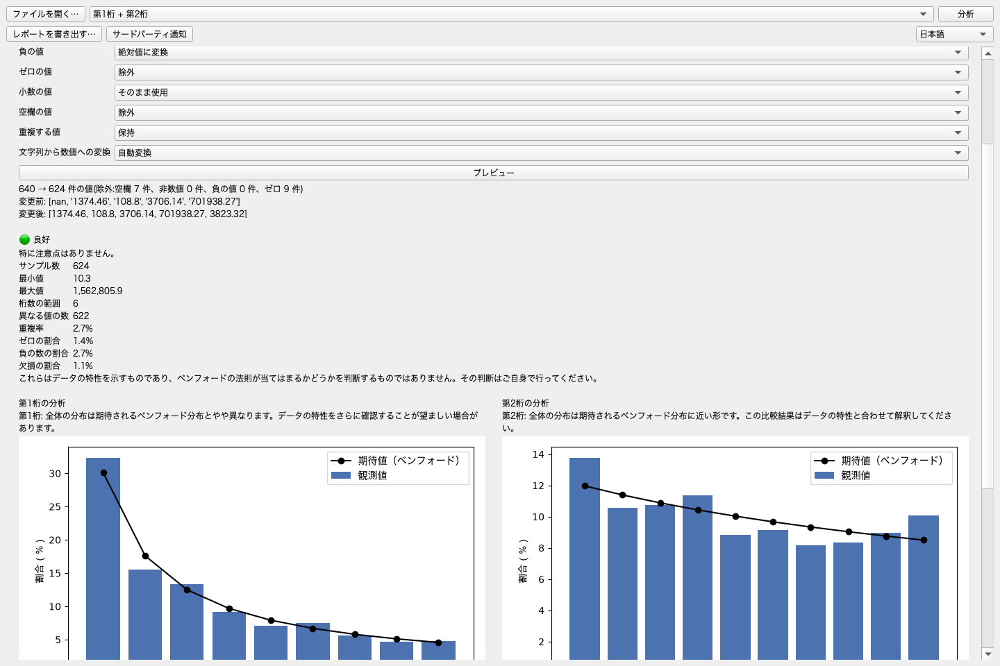
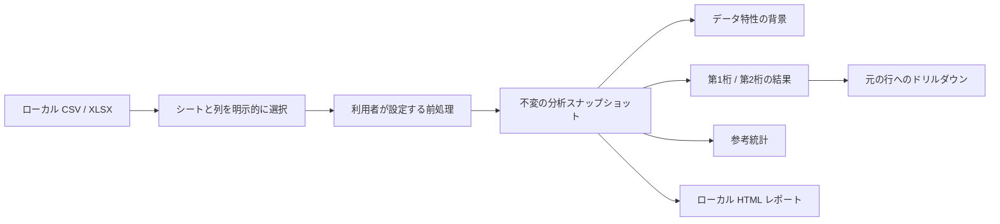

# Benford Lens

[한국어](README.ko.md) · [English](README.md) · [简体中文](README.zh.md) ·
**日本語** · [Français](README.fr.md) · [Español](README.es.md) ·
[Русский](README.ru.md)


Benford Lens は、CSV や Excel データの第1桁・第2桁の分布を専門知識のない方でも
探索できる、ローカルファーストのデスクトップアプリケーションです。ファイルは利用者の
コンピューターから外へ送信されず、ワークシートや列、前処理、分析モードに至るまで、
重要な選択はすべて利用者が明示的に行います。



## このプロジェクトを作った理由

ベンフォード分析は数式として示すのは簡単ですが、責任ある使いやすい製品にすることは
簡単ではありません。実用的なツールには、ベンフォードの法則が適用できるかを自動判定せずに
データの特徴を理解できること、各グラフから元の行を確認できること、機微になり得るデータを
外部サービスへ送信しないことが求められます。

Benford Lens は、ローカルファイルの読み込み、利用者が設定する前処理、桁位置別の分析、
説明的な統計、元データへのドリルダウン、レポートの書き出しを一つのデスクトップワークフローに
まとめています。

## 主な機能

- CSV と XLSX をローカルで読み込み、ワークシートと分析列を明示的に選択します。
- 空欄、ゼロ、負の値、重複、小数、文字列形式の数値をどう扱うか設定し、事前に確認できます。
- 第1桁、第2桁、または両方の観測分布を期待分布と比較します。
- 適用可否を自動判定せず、参考となるデータの特徴を確認できます。
- MAD、カイ二乗、KS、サンプルサイズの参考統計を必要なときだけ表示します。
- グラフの数字をクリックし、該当する元の行を確認・検索・書き出しできます。
- 単体で閲覧できる HTML レポートをローカルに書き出します。
- 英語、韓国語、中国語、日本語、スペイン語、フランス語、ロシア語を切り替えられます。

上の画面は、固定された合成データを使用して実際のアプリケーションから取得したものです。

## ダウンロード

現在の Windows x64 版と macOS Apple Silicon 版は、
[GitHub Releases](https://github.com/internalforces/BenfordLens/releases/latest) から
ダウンロードできます。

- **Windows:** 通常のインストールにはユーザー単位の MSI、ポータブル利用には ZIP を
  選択してください。
- **macOS:** Apple Silicon Mac 用の arm64 ZIP を選択してください。

現在の配布パッケージには、有料のプラットフォーム証明書による署名がありません。
Windows では SmartScreen の警告が表示される場合や、Smart App Control により実行が
ブロックされる場合があります。macOS では**プライバシーとセキュリティ → このまま開く**が
必要になることがあります。実行前に Release ページのセキュリティ情報を読み、対応する
SHA-256 チェックサムを検証してください。

## エンジニアリング上の成果

| 領域 | 結果 |
|------|------|
| 自動品質確認 | 現在の基準で Ruff、書式、22個のソースファイルに対する mypy、全258件のテストに合格 |
| パフォーマンス | 桁抽出の重複を取り除き、記録済みの10万行コントローラーベンチマークを30.0–31.8%改善 |
| 状態の一貫性 | 複合分析では前処理を一度だけ実行し、結果・統計・適用性の背景・行マッピングを一つの不変スナップショットに保存 |
| 国際化 | 組み込み英語と6つの完全な Qt 翻訳カタログ、カタログ整合性および実 UI 回帰テスト |
| デスクトップの安定性 | コンパクト/ワイド表示、CJK フォント、長いロシア語ラベル、グラフ上のホイール操作を回帰テストで検証 |
| パッケージング | macOS arm64 アプリ候補、Windows x64 ZIP、ユーザー単位 MSI 候補を検証 |

パフォーマンス値は同一条件での開発時比較であり、すべてのコンピューターでの性能を保証する
ものではありません。以前の 95.00% というカバレッジ値は記録済みの M3 基準時点のもので、
この README では現在値として扱っていません。

## アーキテクチャの概要



PySide6 UI はワークフローの状態をフレームワーク非依存のコントローラーへ委譲します。
Pandas、NumPy、SciPy を使う分析層は PySide6 をインポートしないため、統計的な動作を
デスクトップ UI から独立してテストできます。データベースやアプリケーションサーバーは
必要ありません。

コンポーネント境界と設計判断は[アーキテクチャガイド](docs/architecture.md)をご覧ください。

## ソースから実行する

要件：Python 3.11 と [uv](https://docs.astral.sh/uv/)。

```bash
uv sync --locked --group dev
uv run benford-lens
```

選択した元ファイルは読み取り専用で開きます。Benford Lens が CSV または HTML を書き込むのは、
利用者が別の書き出し先を明示的に選択した場合だけです。

## プロジェクトを検証する

```bash
uv run ruff check .
uv run ruff format --check src/ tests/ scripts/
uv run mypy src/
QT_QPA_PLATFORM=offscreen uv run pytest
```

現在の検証結果は 258 件のテスト合格です。テスト構成、性能測定方法、パッケージ確認、
明確な検証範囲については[検証ガイド](docs/verification.md)をご覧ください。

## パッケージングとリリース状況

- **macOS:** リリースワークフローは Apple Silicon 用 PyInstaller ZIP をビルドして
  検証します。Developer ID 署名、公証、クリーンマシン検証は未完了です。
- **Windows:** リリースワークフローは x64 PyInstaller ZIP と WiX 5.0.2 のユーザー単位
  MSI をビルドして検証します。Authenticode 署名とクリーンマシン検証は未完了です。
- **Linux:** PyInstaller 設定はありますが、Linux 対象環境ではまだビルド・検証していません。
- **配布:** バージョンタグが作成され、両プラットフォームの処理が成功した後に限り、検証済みの
  未署名パッケージと対応する SHA-256 ファイルを GitHub Releases で公開します。

## ドキュメント

- [ポートフォリオ事例](docs/portfolio-case-study.md) — 製品上の制約、主な技術判断、測定結果、振り返り
- [アーキテクチャ](docs/architecture.md) — レイヤー、データフロー、状態モデル、プライバシー境界
- [検証](docs/verification.md) — 自動テスト、性能の根拠、リリース確認
- [ユーザーガイド](docs/user-guide.md) — ファイル読み込み、前処理、分析、ドリルダウン、書き出し

詳細な開発記録は `memory/`、`tasks/`、`reports/` に保持しています。上記4文書だけを、
意図的に小さく保った公開閲覧経路としています。

## コミュニティと通知

- [コントリビューションガイド](CONTRIBUTING.md) — 開発環境、プロジェクト境界、Pull Request
- [サポート](SUPPORT.md) — 利用支援、サポート範囲、安全な合成データによる再現
- [セキュリティポリシー](SECURITY.md) — 非公開でのセキュリティ報告とサポート対象バージョン
- [行動規範](CODE_OF_CONDUCT.md) — 相互を尊重した参加と非公開での報告
- [サードパーティ通知](THIRD_PARTY_NOTICES.md) — 正確なランタイム一覧、ライセンス本文、
  ソース、帰属、Qt 再リンクの案内

## プライバシーと解釈の境界

- データはローカルのメモリ内で処理され、ログイン、テレメトリ、クラウド分析、オンライン
  アップロード経路はありません。
- アプリケーションは元の CSV/XLSX ファイルを変更しません。
- Benford Lens は分布とデータ特性を説明しますが、ベンフォードの法則がデータセットに
  適用できるかを判断しません。その判断は利用者に委ねられます。

## ライセンス

Benford Lens は [MIT License](LICENSE) で提供します。サードパーティコンポーネントには、
[サードパーティ通知](THIRD_PARTY_NOTICES.md)に記載された各ライセンス条件が適用されます。
