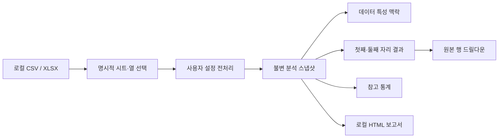

# Benford Lens

**한국어** · [English](README.md)


Benford Lens는 CSV와 Excel 데이터의 첫째·둘째 자리 분포를 비전문가도 탐색할 수 있게 만든
로컬 우선 데스크톱 애플리케이션입니다. 파일은 사용자의 컴퓨터를 벗어나지 않으며, 워크시트와
열 선택부터 전처리·분석 모드까지 중요한 판단을 항상 사용자가 직접 내립니다.


## 프로젝트를 만든 이유

벤포드 분석은 수식으로 설명하기는 쉽지만 책임 있는 제품으로 만들기는 어렵습니다. 실제 도구는
법칙의 적용 여부를 자동 판단하지 않으면서 데이터 특성을 이해하도록 도와야 하고, 모든 차트가
어떤 원본 행에서 나왔는지 추적할 수 있어야 하며, 민감할 수 있는 데이터를 외부 서비스로 보내지
않아야 합니다.

Benford Lens는 이 문제를 로컬 파일 불러오기, 사용자 주도 전처리, 자릿수별 분석, 참고 통계,
원본 행 탐색, 보고서 내보내기가 이어지는 완결된 데스크톱 흐름으로 해결합니다.

## 주요 기능

- CSV와 XLSX를 로컬에서 열고 워크시트와 분석 열을 명시적으로 선택합니다.
- 빈 값, 0, 음수, 중복, 소수, 문자형 숫자의 처리 방식을 사용자가 정하고 미리 확인합니다.
- 첫째 자리, 둘째 자리 또는 두 결과를 함께 기대 분포와 비교합니다.
- 자동 적용 판정 없이 표본 수, 값의 범위, 중복률 같은 데이터 특성을 확인합니다.
- MAD, 카이제곱, KS, 표본 크기 참고 통계를 필요할 때만 펼쳐 봅니다.
- 차트의 숫자를 클릭해 해당 원본 행을 검색하고 별도 CSV로 저장합니다.
- 분석 스냅샷을 기반으로 독립 실행형 HTML 보고서를 로컬에 저장합니다.
- 영어·한국어·중국어·일본어·스페인어·프랑스어·러시아어 UI를 선택합니다.


위 시각 자료는 모두 결정론적 합성 데이터로 실제 애플리케이션을 구동해 캡처했습니다.

## 엔지니어링 성과

| 영역 | 결과 |
|------|------|
| 자동화 품질 | 현재 기준선에서 Ruff·형식 검사·22개 소스 파일 mypy·241개 테스트가 모두 통과 |
| 성능 | 반복 자릿수 추출을 제거해 기록된 10만 행 컨트롤러 벤치마크가 30.0–31.8% 개선 |
| 상태 일관성 | 결합 분석에서 전처리를 한 번만 수행하고 결과·통계·적합성 맥락·행 매핑을 하나의 불변 스냅샷에 저장 |
| 국제화 | 내장 영어와 6개 완전한 Qt 번역 카탈로그, 카탈로그 동등성 및 실제 UI 회귀 테스트 |
| 데스크톱 안정성 | 작은/큰 화면, CJK 글꼴, 긴 러시아어 레이블, 차트 위 휠 스크롤 회귀 테스트 |
| 패키징 | macOS arm64 앱 후보와 Windows x64 ZIP·사용자 범위 MSI 후보 검증 |

성능 수치는 동일 조건의 개발 비교 측정이며 모든 컴퓨터에서의 성능을 보장하지 않습니다. 기존
95.00% 커버리지는 M3 당시의 기록이므로 현재 커버리지처럼 표시하지 않습니다.

## 아키텍처 한눈에 보기



PySide6 UI는 워크플로 상태를 프레임워크 비종속 컨트롤러에 위임합니다. Pandas·NumPy·SciPy를
사용하는 분석 계층은 PySide6를 가져오지 않으므로 통계 동작을 데스크톱 UI와 독립적으로 시험할
수 있습니다. 데이터베이스나 애플리케이션 서버는 없습니다.

구성 요소 경계와 주요 판단은 [아키텍처 문서](docs/architecture.md)에서 확인할 수 있습니다.

## 소스에서 실행하기

필요 환경: Python 3.11과 [uv](https://docs.astral.sh/uv/).

```bash
uv sync --locked --group dev
uv run benford-lens
```

선택한 원본 파일은 읽기 전용으로 다룹니다. 사용자가 별도의 내보내기 위치를 명시적으로 고른
경우에만 CSV 또는 HTML 파일을 씁니다.

## 프로젝트 검증하기

```bash
uv run ruff check .
uv run ruff format --check src/ tests/ scripts/
uv run mypy src/
QT_QPA_PLATFORM=offscreen uv run pytest
```

현재 검증 결과는 241개 테스트 통과입니다. 테스트 범위, 성능 측정 방식, 패키징 검사, 명확한
검증 경계는 [검증 문서](docs/verification.md)에 정리했습니다.

## 패키징과 공개 상태

- **macOS:** Apple Silicon PyInstaller 후보를 빌드하고 헤드리스 실행을 확인했습니다.
  Developer ID 서명·공증·클린 머신 검증이 남아 있습니다.
- **Windows:** x64 PyInstaller ZIP과 WiX 5.0.2 사용자 범위 MSI가 로컬 실행 및
  설치·실행·제거 검사를 통과했습니다. Authenticode 서명과 클린 머신 검증이 남아 있습니다.
- **Linux:** PyInstaller 설정은 있으나 Linux 대상 환경에서 빌드하지 않았습니다.
- **공개 릴리스:** 소스 메타데이터는 1.0.0이지만 공개 `v1.0.0` 태그와 GitHub Release는
  아직 없습니다.

## 공개 문서

- [포트폴리오 사례 연구](docs/portfolio-case-study.md) — 제품 제약, 핵심 기술 판단, 측정 결과,
  회고
- [아키텍처](docs/architecture.md) — 계층, 데이터 흐름, 상태 모델, 개인정보 보호 경계
- [검증](docs/verification.md) — 자동화 테스트, 성능 근거, 릴리스 검사
- [사용자 가이드](docs/user-guide.md) — 파일 열기, 전처리, 분석, 드릴다운, 내보내기

상세 개발 증거는 `memory/`, `tasks/`, `reports/`에 그대로 보존하며, 위 네 문서만 의도적으로
짧은 공개 탐색 경로로 사용합니다.

## 개인정보 보호와 해석 경계

- 데이터는 로컬 메모리에서 처리하며 로그인, 텔레메트리, 클라우드 분석, 온라인 업로드 경로가
  없습니다.
- 애플리케이션은 원본 CSV/XLSX 파일을 수정하지 않습니다.
- Benford Lens는 분포와 데이터 특성을 설명하지만 벤포드 법칙의 적용 여부를 결정하지 않습니다.
  그 판단은 사용자에게 남아 있습니다.

## 라이선스

Benford Lens는 [MIT License](LICENSE)로 제공됩니다.
