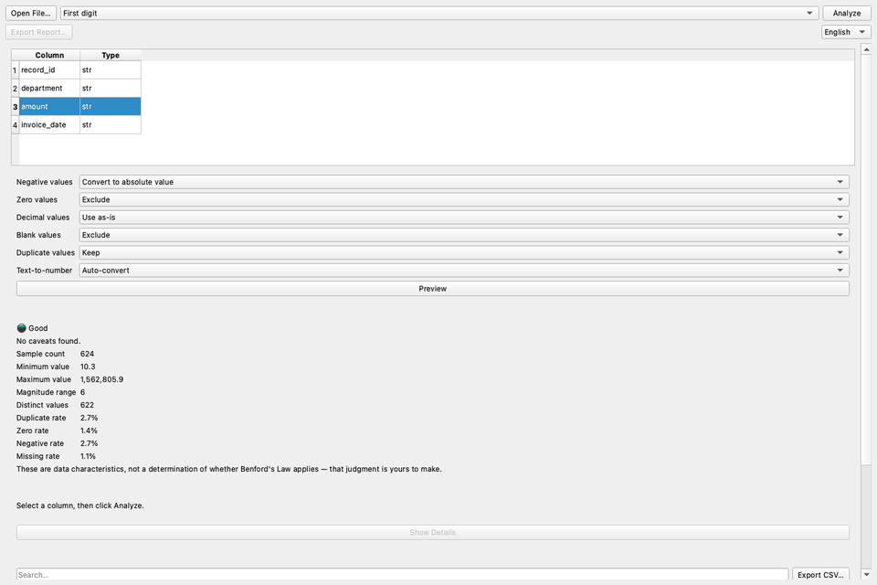
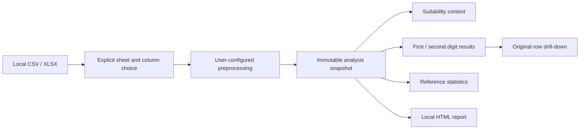

# Benford Lens

[한국어](README.ko.md) · **English** · [简体中文](README.zh.md) ·
[日本語](README.ja.md) · [Français](README.fr.md) · [Español](README.es.md) ·
[Русский](README.ru.md)


Benford Lens is a local-first desktop application that helps non-experts explore first- and
second-digit distributions in CSV and Excel data. Files remain on the user's machine, and every
important choice—from the worksheet and column to preprocessing and analysis mode—stays explicit.


## Why this project

Benford analysis is easy to present as a formula and much harder to turn into a responsible,
usable product. A practical tool must help people inspect data characteristics without making an
automatic applicability decision, preserve the original rows behind every chart, and keep
sensitive datasets out of remote services.

Benford Lens addresses that product problem as a complete desktop workflow: local file loading,
user-controlled preprocessing, position-aware analysis, explanatory statistics, drill-down, and
report export.

## Product highlights

- Load CSV and XLSX files locally, with explicit worksheet and column selection.
- Preview user-controlled handling of blanks, zeroes, negatives, duplicates, decimals, and
  text-formatted numbers.
- Compare observed and expected first-digit, second-digit, or combined distributions.
- Review advisory data characteristics without an automatic applicability verdict.
- Reveal optional MAD, Chi-square, KS, and sample-size reference statistics.
- Click a chart digit to inspect, search, and export matching original rows.
- Export a self-contained local HTML report.
- Switch among English, Korean, Chinese, Japanese, Spanish, French, and Russian.



All visuals above were captured from the real application using deterministic synthetic data.

## Download

Download the current Windows x64 and macOS Apple Silicon packages from
[GitHub Releases](https://github.com/internalforces/BenfordLens/releases/latest).

- **Windows:** choose the per-user MSI for a standard installation or the ZIP for a portable
  folder.
- **macOS:** choose the arm64 ZIP for Apple Silicon Macs.

The downloadable packages are currently unsigned. Windows may show a SmartScreen warning or
block the app under Smart App Control, and macOS may require **Privacy & Security → Open Anyway**.
Review the security notice and verify the matching SHA-256 checksum on the Release page before
running a package.

## Engineering outcomes

| Area | Result |
|------|--------|
| Automated quality | Ruff, formatting, mypy across 22 source files, and all 259 tests pass on the current baseline |
| Performance | The recorded 100,000-row controller benchmark improved by 30.0–31.8% after repeated digit extraction was removed |
| State consistency | Combined analysis preprocesses once and stores results, statistics, suitability, and row mappings in one immutable snapshot |
| Internationalization | Six complete Qt translation catalogs plus built-in English, including catalog-parity and live UI regression tests |
| Desktop resilience | Regression coverage for compact/wide layouts, CJK fonts, long Russian labels, and wheel scrolling over charts |
| Packaging | Verified macOS arm64 app candidate plus Windows x64 ZIP and user-scoped MSI candidates |

Performance figures are comparative development measurements, not guarantees for every machine.
The previous 95.00% coverage measurement belongs to the recorded M3 baseline; this README does
not present it as current coverage.

## Architecture at a glance



The PySide6 UI delegates workflow state to a framework-agnostic controller. The analysis layer
uses Pandas, NumPy, and SciPy without importing PySide6, so statistical behavior can be tested
independently from the desktop interface. No component requires a database or application server.

Read the [architecture guide](docs/architecture.md) for component boundaries and design choices.

## Run from source

Requirements: Python 3.11 and [uv](https://docs.astral.sh/uv/).

```bash
uv sync --locked --group dev
uv run benford-lens
```

The selected source file is opened read-only. Benford Lens writes a CSV or HTML file only when
the user explicitly chooses a separate export destination.

## Verify the project

```bash
uv run ruff check .
uv run ruff format --check src/ tests/ scripts/
uv run mypy src/
QT_QPA_PLATFORM=offscreen uv run pytest
```

The current verified result is 259 passing tests. See the
[verification guide](docs/verification.md) for the test matrix, performance method, packaging
checks, and explicit verification boundaries.

## Packaging and release status

- **macOS:** the release workflow builds and verifies an Apple Silicon PyInstaller ZIP. Developer
  ID signing, notarization, and clean-machine verification remain.
- **Windows:** the release workflow builds and verifies an x64 PyInstaller ZIP and a WiX 5.0.2
  per-user MSI. Authenticode signing and clean-machine verification remain.
- **Linux:** a PyInstaller specification exists but has not been built on a Linux target.
- **Distribution:** version tags publish the verified unsigned packages and matching SHA-256
  files through GitHub Releases only after both platform jobs pass.

## Documentation

- [Portfolio case study](docs/portfolio-case-study.md) — product constraints, key engineering
  decisions, measured outcomes, and retrospective
- [Architecture](docs/architecture.md) — layers, data flow, state model, and privacy boundary
- [Verification](docs/verification.md) — automated tests, performance evidence, and release checks
- [User guide](docs/user-guide.md) — file loading, preprocessing, analysis, drill-down, and export
- [Roadmap](roadmap.md) — the single required follow-up distribution milestone

These documents are the maintained public reading path. Historical implementation detail
remains available through Git history when needed.

## Community and notices

- [Contributing guide](CONTRIBUTING.md) — development setup, project boundaries, and pull requests
- [Support](SUPPORT.md) — usage help, supported scope, and safe synthetic reproductions
- [Security policy](SECURITY.md) — private vulnerability reporting and supported versions
- [Code of Conduct](CODE_OF_CONDUCT.md) — respectful participation and private conduct reports
- [Third-party notices](THIRD_PARTY_NOTICES.md) — exact runtime inventory, license texts, sources,
  attributions, and Qt relinking guidance

## Privacy and interpretation boundary

- Data processing is local and in memory; there is no login, telemetry, cloud analysis, or online
  upload path.
- The application never modifies the original CSV/XLSX file.
- Benford Lens describes distributions and data characteristics. It does not decide whether
  Benford's Law applies to a dataset; that judgment remains with the user.

## License

Benford Lens is available under the [MIT License](LICENSE). Third-party components remain subject
to their respective terms documented in the [third-party notices](THIRD_PARTY_NOTICES.md).
