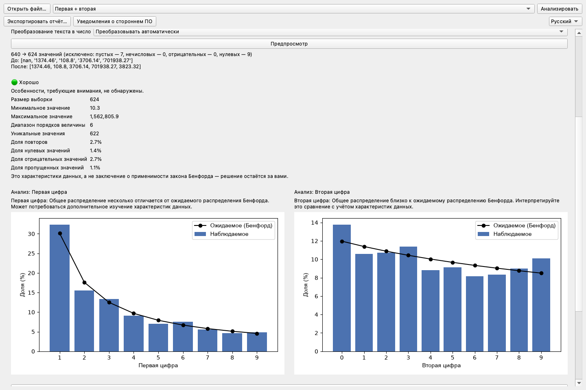
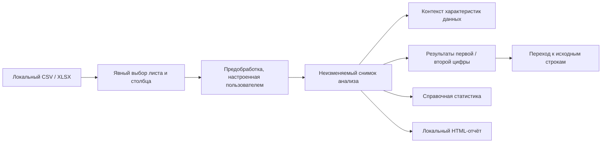

# Benford Lens

[한국어](README.ko.md) · [English](README.md) · [简体中文](README.zh.md) ·
[日本語](README.ja.md) · [Français](README.fr.md) · [Español](README.es.md) ·
**Русский**


Benford Lens — локальное настольное приложение, которое помогает неспециалистам исследовать
распределения первой и второй цифры в данных CSV и Excel. Файлы остаются на компьютере
пользователя, а каждый важный выбор — от листа и столбца до предобработки и режима анализа —
выполняется явно.



## Зачем создан этот проект

Анализ по закону Бенфорда легко представить формулой, но гораздо сложнее превратить в
ответственный и удобный продукт. Практический инструмент должен помогать понимать характеристики
данных, не решая автоматически, применим ли закон Бенфорда; сохранять связь каждого графика с
исходными строками; и не передавать потенциально чувствительные наборы данных удалённым сервисам.

Benford Lens объединяет эти требования в цельный настольный процесс: локальная загрузка файлов,
предобработка под управлением пользователя, анализ по позиции цифры, поясняющая статистика,
переход к исходным строкам и экспорт отчёта.

## Основные возможности

- Локальная загрузка CSV и XLSX с явным выбором листа и столбца.
- Предпросмотр выбранной обработки пустых, нулевых, отрицательных, повторяющихся и десятичных
  значений, а также чисел в текстовом формате.
- Сравнение наблюдаемого и ожидаемого распределения первой цифры, второй цифры или обеих сразу.
- Просмотр справочных характеристик данных без автоматического решения о применимости.
- Отображение по запросу справочной статистики MAD, хи-квадрат, KS и размера выборки.
- Переход по цифре на графике к просмотру, поиску и экспорту соответствующих исходных строк.
- Локальный экспорт автономного HTML-отчёта.
- Переключение между английским, корейским, китайским, японским, испанским, французским и русским интерфейсами.

Снимок выше сделан в настоящем приложении с использованием детерминированных синтетических данных.

## Загрузка

Актуальные пакеты для Windows x64 и macOS Apple Silicon доступны в
[GitHub Releases](https://github.com/internalforces/BenfordLens/releases/latest).

- **Windows:** выберите пользовательский MSI для обычной установки или ZIP для портативного запуска.
- **macOS:** выберите arm64 ZIP для компьютеров Mac с Apple Silicon.

Сейчас загружаемые пакеты не подписаны платными сертификатами платформ. Windows может показать
предупреждение SmartScreen или заблокировать приложение через Smart App Control. В macOS может
потребоваться выбрать **Конфиденциальность и безопасность → Всё равно открыть**. Перед запуском
ознакомьтесь с уведомлением о безопасности и проверьте соответствующую контрольную сумму SHA-256
на странице Release.

## Инженерные результаты

| Область | Результат |
|---------|-----------|
| Автоматизированное качество | На текущей базе проходят Ruff, проверка форматирования, mypy для 22 исходных файлов и все 259 тестов |
| Производительность | Устранение повторного извлечения цифр улучшило записанный тест контроллера на 100 000 строк на 30,0–31,8 % |
| Согласованность состояния | Комбинированный анализ выполняет предобработку один раз и сохраняет результаты, статистику, контекст применимости и сопоставления строк в одном неизменяемом снимке |
| Интернационализация | Шесть полных каталогов Qt в дополнение к встроенному английскому, с тестами равенства каталогов и реального интерфейса |
| Устойчивость интерфейса | Проверки компактной/широкой компоновки, шрифтов CJK, длинных русских подписей и прокрутки колёсиком над графиками |
| Упаковка | Проверены кандидат приложения macOS arm64, ZIP Windows x64 и пользовательский MSI |

Показатели производительности — сравнительные измерения разработки, а не гарантия для каждого
компьютера. Предыдущее значение покрытия 95,00 % относится к зафиксированной базе M3; этот README
не представляет его как текущее покрытие.

## Краткая архитектура



Интерфейс PySide6 передаёт состояние рабочего процесса независимому от фреймворка контроллеру.
Слой анализа использует Pandas, NumPy и SciPy без импорта PySide6, поэтому статистическое поведение
можно тестировать отдельно от настольного интерфейса. База данных и сервер приложений не требуются.

Границы компонентов и проектные решения описаны в
[руководстве по архитектуре](docs/architecture.md).

## Запуск из исходного кода

Требования: Python 3.11 и [uv](https://docs.astral.sh/uv/).

```bash
uv sync --locked --group dev
uv run benford-lens
```

Выбранный исходный файл открывается только для чтения. Benford Lens записывает CSV или HTML,
только когда пользователь явно выбирает отдельное место для экспорта.

## Проверка проекта

```bash
uv run ruff check .
uv run ruff format --check src/ tests/ scripts/
uv run mypy src/
QT_QPA_PLATFORM=offscreen uv run pytest
```

Текущий проверенный результат — 259 успешно пройденных тестов. Матрица тестов, метод измерения
производительности, проверки упаковки и явные границы проверки приведены в
[руководстве по проверке](docs/verification.md).

## Состояние упаковки и выпуска

- **macOS:** процесс выпуска создаёт и проверяет ZIP PyInstaller для Apple Silicon. Подпись
  Developer ID, нотариальное заверение и проверка на чистой машине ещё не выполнены.
- **Windows:** процесс выпуска создаёт и проверяет x64 ZIP PyInstaller и пользовательский MSI
  WiX 5.0.2. Подпись Authenticode и проверка на чистой машине ещё не выполнены.
- **Linux:** конфигурация PyInstaller существует, но ещё не собиралась и не проверялась на Linux.
- **Распространение:** теги версий публикуют проверенные неподписанные пакеты и соответствующие
  файлы SHA-256 через GitHub Releases только после успешного выполнения заданий обеих платформ.

## Документация

- [Пример проекта для портфолио](docs/portfolio-case-study.md) — ограничения продукта, ключевые
  инженерные решения, измеренные результаты и ретроспектива
- [Архитектура](docs/architecture.md) — слои, поток данных, модель состояния и граница конфиденциальности
- [Проверка](docs/verification.md) — автоматизированные тесты, данные о производительности и проверки выпуска
- [Руководство пользователя](docs/user-guide.md) — загрузка, предобработка, анализ, детализация и экспорт
- [Дорожная карта](roadmap.md) — единственный необходимый следующий этап распространения

Документы выше образуют поддерживаемый публичный маршрут чтения. Исторические детали
реализации при необходимости доступны в истории Git.

## Сообщество и уведомления

- [Руководство для участников](CONTRIBUTING.md) — среда разработки, границы проекта и Pull Requests
- [Поддержка](SUPPORT.md) — помощь по использованию, поддерживаемая область и безопасные синтетические примеры
- [Политика безопасности](SECURITY.md) — закрытое сообщение о проблемах безопасности и поддерживаемые версии
- [Кодекс поведения](CODE_OF_CONDUCT.md) — уважительное участие и закрытые сообщения
- [Уведомления о стороннем ПО](THIRD_PARTY_NOTICES.md) — точный состав среды выполнения,
  тексты лицензий, источники, атрибуция и инструкции по перелинковке Qt

## Конфиденциальность и границы интерпретации

- Данные обрабатываются локально и в памяти; нет входа в учётную запись, телеметрии, облачного
  анализа или пути загрузки данных в интернет.
- Приложение никогда не изменяет исходный файл CSV/XLSX.
- Benford Lens описывает распределения и характеристики данных. Программа не решает, применим ли
  закон Бенфорда к набору данных; это решение остаётся за пользователем.

## Лицензия

Benford Lens доступен по [лицензии MIT](LICENSE). Сторонние компоненты остаются под действием
соответствующих условий, перечисленных в
[уведомлениях о стороннем ПО](THIRD_PARTY_NOTICES.md).
