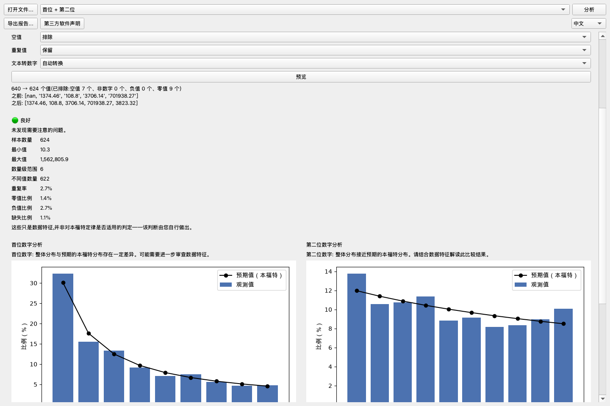
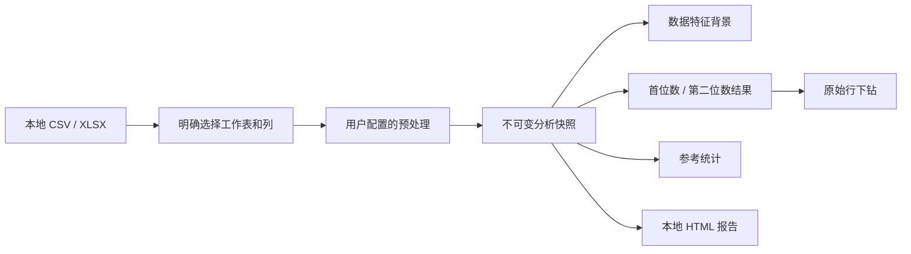

# Benford Lens

[한국어](README.ko.md) · [English](README.md) · **简体中文** ·
[日本語](README.ja.md) · [Français](README.fr.md) · [Español](README.es.md) ·
[Русский](README.ru.md)


Benford Lens 是一款本地优先的桌面应用程序，帮助非专业用户探索 CSV 和 Excel 数据中
首位数与第二位数的分布。文件始终保留在用户的计算机上；从工作表、分析列到预处理方式和
分析模式，每一项重要选择都由用户明确作出。



## 为什么开发这个项目

本福特分析很容易用公式展示，却很难转化为负责任且易用的产品。实用的工具应帮助用户理解
数据特征，而不是自动判断本福特定律是否适用；它还应保留每张图表与原始行之间的对应关系，
并避免将可能敏感的数据发送到远程服务。

Benford Lens 将这些要求整合为一套完整的桌面工作流：本地文件加载、用户控制的预处理、
按数位分析、说明性统计、原始行下钻以及报告导出。

## 主要功能

- 在本地加载 CSV 和 XLSX 文件，并明确选择工作表和分析列。
- 预览并自行设置空值、零、负数、重复值、小数和文本格式数字的处理方式。
- 将首位数、第二位数或两者的观测分布与期望分布进行比较。
- 查看提示性的数据特征，而不自动给出适用性结论。
- 按需展开 MAD、卡方、KS 和样本量参考统计。
- 单击图表中的数字，检查、搜索并导出相应的原始行。
- 在本地导出可独立查看的 HTML 报告。
- 在英语、韩语、中文、日语、西班牙语、法语和俄语界面之间切换。

上方界面使用固定的合成数据，通过真实应用程序生成和截取。

## 下载

请从 [GitHub Releases](https://github.com/internalforces/BenfordLens/releases/latest)
下载当前的 Windows x64 和 macOS Apple Silicon 软件包。

- **Windows：**常规安装请选择按用户安装的 MSI；便携使用请选择 ZIP。
- **macOS：**Apple Silicon Mac 请选择 arm64 ZIP。

目前提供的软件包尚未使用付费的平台证书签名。Windows 可能显示 SmartScreen 警告，
Smart App Control 也可能阻止应用运行；macOS 可能需要在**隐私与安全性 → 仍要打开**中
确认。运行前请阅读 Release 页面的安全说明，并验证对应的 SHA-256 校验和。

## 工程成果

| 领域 | 结果 |
|------|------|
| 自动化质量 | 当前基线通过 Ruff、格式检查、针对 22 个源文件的 mypy 检查以及全部 259 项测试 |
| 性能 | 移除重复数位提取后，记录的 10 万行控制器基准测试提升了 30.0–31.8% |
| 状态一致性 | 组合分析只执行一次预处理，并将结果、统计、适用性背景和行映射保存在一个不可变快照中 |
| 国际化 | 内置英语和 6 套完整的 Qt 翻译目录，并包含目录一致性及真实 UI 回归测试 |
| 桌面稳定性 | 覆盖紧凑/宽屏布局、CJK 字体、较长的俄语标签以及图表上的滚轮操作 |
| 打包 | 已验证 macOS arm64 应用候选包、Windows x64 ZIP 和按用户安装的 MSI 候选包 |

性能数据是在相同条件下进行的开发对比测量，并不保证所有计算机都能获得相同结果。
此前的 95.00% 覆盖率属于已记录的 M3 基线，本 README 不将其表述为当前覆盖率。

## 架构概览



PySide6 UI 将工作流状态委托给与框架无关的控制器。分析层使用 Pandas、NumPy 和 SciPy，
且不导入 PySide6，因此统计行为可以独立于桌面界面进行测试。应用不需要数据库或应用服务器。

组件边界和设计选择详见[架构指南](docs/architecture.md)。

## 从源代码运行

要求：Python 3.11 和 [uv](https://docs.astral.sh/uv/)。

```bash
uv sync --locked --group dev
uv run benford-lens
```

所选源文件以只读方式打开。只有在用户明确选择单独的导出位置时，Benford Lens 才会写入
CSV 或 HTML 文件。

## 验证项目

```bash
uv run ruff check .
uv run ruff format --check src/ tests/ scripts/
uv run mypy src/
QT_QPA_PLATFORM=offscreen uv run pytest
```

当前验证结果为 259 项测试通过。测试矩阵、性能测量方法、打包检查以及明确的验证边界详见
[验证指南](docs/verification.md)。

## 打包与发布状态

- **macOS：**发布工作流会构建并验证 Apple Silicon PyInstaller ZIP。Developer ID 签名、
  公证和全新机器验证仍待完成。
- **Windows：**发布工作流会构建并验证 x64 PyInstaller ZIP 和 WiX 5.0.2 按用户安装的
  MSI。Authenticode 签名和全新机器验证仍待完成。
- **Linux：**已有 PyInstaller 配置，但尚未在 Linux 目标环境中构建和验证。
- **分发：**创建版本标签后，只有两个平台任务均通过，才会通过 GitHub Releases 发布
  已验证但未签名的软件包及对应的 SHA-256 文件。

## 文档

- [作品案例研究](docs/portfolio-case-study.md) — 产品约束、关键工程决策、测量结果与回顾
- [架构](docs/architecture.md) — 分层、数据流、状态模型与隐私边界
- [验证](docs/verification.md) — 自动化测试、性能依据与发布检查
- [用户指南](docs/user-guide.md) — 文件加载、预处理、分析、下钻与导出
- [路线图](roadmap.md) — 唯一必要的后续可信分发里程碑

以上文档是当前维护的公开阅读路径。需要时，可通过 Git 历史查看过去的实现细节。

## 社区与声明

- [贡献指南](CONTRIBUTING.md) — 开发环境、项目边界与 Pull Request
- [支持](SUPPORT.md) — 使用帮助、支持范围与安全的合成数据复现方式
- [安全策略](SECURITY.md) — 私下报告安全问题及受支持版本
- [行为准则](CODE_OF_CONDUCT.md) — 尊重参与者以及私下报告相关问题
- [第三方声明](THIRD_PARTY_NOTICES.md) — 完整运行时清单、许可证文本、来源、署名信息与
  Qt 重新链接指南

## 隐私与解释边界

- 数据仅在本地内存中处理；不存在登录、遥测、云端分析或在线上传路径。
- 应用程序绝不会修改原始 CSV/XLSX 文件。
- Benford Lens 描述分布与数据特征，但不会决定本福特定律是否适用于某个数据集；这一判断
  始终由用户作出。

## 许可证

Benford Lens 采用 [MIT License](LICENSE)。第三方组件仍受
[第三方声明](THIRD_PARTY_NOTICES.md)中所列各自条款的约束。
