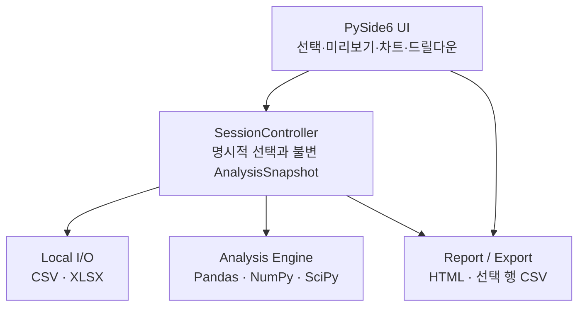
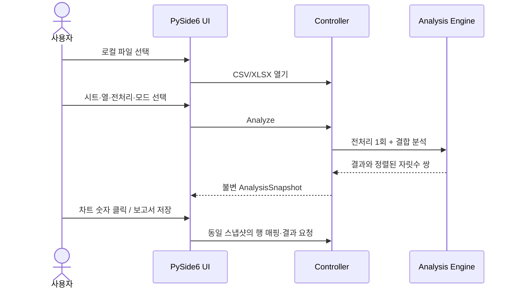
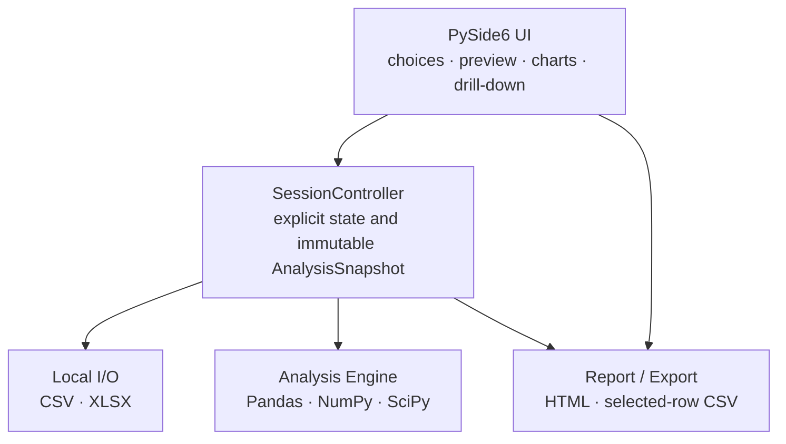
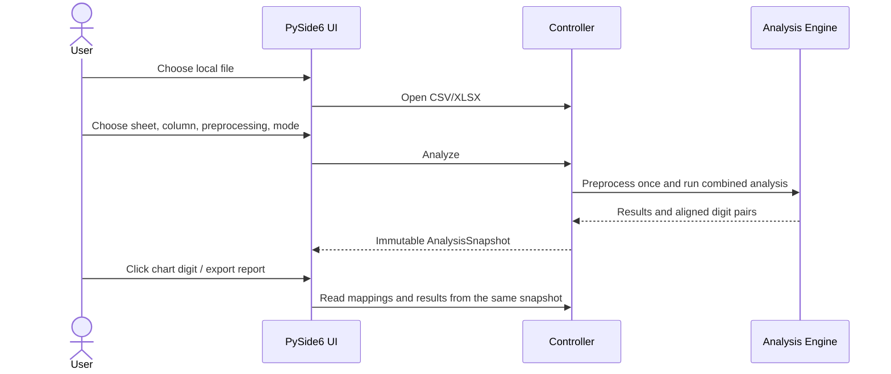

# Benford Lens — Architecture

[한국어](#한국어) · [English](#english)

## 한국어

### 설계 목표

- 사용자 파일과 분석 결과가 로컬 컴퓨터를 벗어나지 않는다.
- 시트, 열, 전처리, 분석 모드를 사용자가 명시적으로 선택한다.
- 통계 계산을 UI와 독립적으로 테스트할 수 있다.
- 화면, 드릴다운, 보고서가 같은 분석 상태를 설명한다.
- 원본 CSV/XLSX 파일을 수정하지 않는다.

### 계층 구조

| 계층 | 책임 | 주요 모듈 |
|------|------|-----------|
| UI | 명시적 사용자 입력, 반응형 결과, 번역, 차트 이벤트 | `src/benford_lens/ui/` |
| Controller | 세션 상태, 전처리/분석 조율, 결과 무효화, 행 매핑 | `ui/controller.py` |
| Analysis | 자릿수 추출, 기대·관측 분포, 전처리, 데이터 특성, 참고 통계 | `analysis/` |
| I/O | 로컬 CSV/XLSX 읽기와 시트 목록 | `io/` |
| Report/Export | 스냅샷 기반 HTML과 사용자 요청 CSV | `report/`, `ui/drill_down_panel.py` |

분석 계층은 PySide6를 가져오지 않습니다. UI 없이도 통계 계산과 경계 조건을 시험할 수 있고,
데스크톱 프레임워크가 분석 규칙을 소유하지 않게 합니다.

### 데이터 흐름

### 상태 모델

`SessionState`는 현재 데이터프레임, 시트, 선택 열, 전처리 옵션, 분석 모드와 최신
`AnalysisSnapshot`을 메모리에 보관합니다. 스냅샷은 다음을 한 번에 고정합니다.

- 분석에 실제 사용된 전처리 옵션과 미리보기
- 데이터 특성 평가
- 단일 또는 결합 자릿수 결과
- 위치별 MAD/카이제곱과 공유 로그 가수 KS 결과
- 원본 인덱스와 첫째·둘째 자리 매핑

열, 모드, 전처리 또는 파일이 바뀌면 차트, 통계, 드릴다운, 보고서 활성 상태를 함께
무효화합니다.

### 주요 설계 판단

| 판단 | 이유 |
|------|------|
| 결합 모드는 10–99 공동 분포가 아니라 첫째·둘째 자리 결과의 동시 표시 | 기존 분석 의미를 보존하고 사용자가 두 위치를 직접 비교하게 함 |
| 불변 스냅샷 | 화면·드릴다운·보고서의 상태 불일치 방지 |
| 참고 통계 상세는 기본 접힘 | 비전문가 흐름을 단순하게 유지하면서 검토 근거 제공 |
| 좁은 화면은 세로, 넓은 화면은 가로 결합 차트 | 두 결과를 탭 뒤에 숨기지 않고 읽을 수 있는 크기 유지 |
| `string.Template` 기반 HTML | 새 런타임 의존성 없이 로컬 독립 보고서 생성 |

### 개인정보 보호 경계

- 애플리케이션 런타임에는 서버, 데이터베이스, 계정, 텔레메트리, 업데이트 확인이 없습니다.
- 파일은 사용자가 고른 로컬 경로에서 읽고 메모리에서 처리합니다.
- 내보내기는 사용자가 별도 위치를 선택한 경우에만 실행합니다.
- 네트워크를 사용하는 빌드 도구는 개발/패키징 시점의 의존성 취득에만 해당하며 앱의 분석
  경로가 아닙니다.

---

## English

### Design goals

- User files and derived analysis stay on the local machine.
- Sheet, column, preprocessing, and analysis mode remain explicit user choices.
- Statistical behavior can be tested independently from the UI.
- Screen output, drill-down, and reports describe one consistent analysis state.
- The source CSV/XLSX file is never modified.

### Layered structure

| Layer | Responsibility | Main modules |
|-------|----------------|--------------|
| UI | Explicit input, responsive results, translation, chart events | `src/benford_lens/ui/` |
| Controller | Session state, orchestration, invalidation, row mappings | `ui/controller.py` |
| Analysis | Digits, distributions, preprocessing, suitability context, statistics | `analysis/` |
| I/O | Local CSV/XLSX reading and sheet listing | `io/` |
| Report/Export | Snapshot-based HTML and user-requested CSV | `report/`, `ui/drill_down_panel.py` |

The analysis layer does not import PySide6. Statistical and boundary behavior can therefore be
tested without a desktop window, and the UI framework does not own analysis rules.

### Data flow

### State model

`SessionState` keeps the current dataframe, sheet, selected column, preprocessing options,
analysis mode, and latest `AnalysisSnapshot` in memory. The snapshot freezes the exact
preprocessing choice and preview, suitability context, single or combined result, per-position
MAD/Chi-square values, shared log-mantissa KS result, and original-index digit mappings.

Changing the file, column, mode, or preprocessing invalidates charts, statistics, drill-down,
and report availability together.

### Key decisions

| Decision | Reason |
|----------|--------|
| Combined mode shows independent first- and second-digit results, not a joint 10–99 distribution | Preserve existing semantics and make both positions directly comparable |
| Immutable snapshot | Prevent screen, drill-down, and report state from drifting |
| Reference details collapsed by default | Keep the non-expert path simple while retaining evidence |
| Stack combined charts when compact and place them side by side when wide | Keep both visible without unreadable chart sizes |
| `string.Template` HTML | Produce a local standalone report without another runtime dependency |

### Privacy boundary

- The application runtime has no server, database, account, telemetry, or update-check path.
- Files are read from a user-selected local path and processed in memory.
- Exports occur only after the user selects a separate destination.
- Network access used by development/build tooling to obtain dependencies is not part of the
  application's analysis path.
