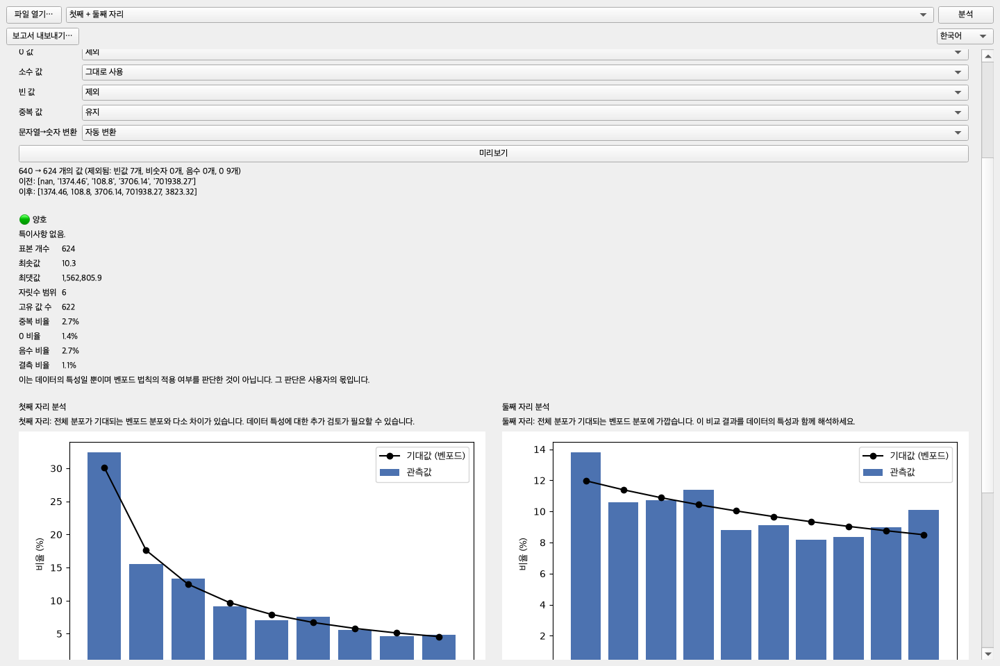
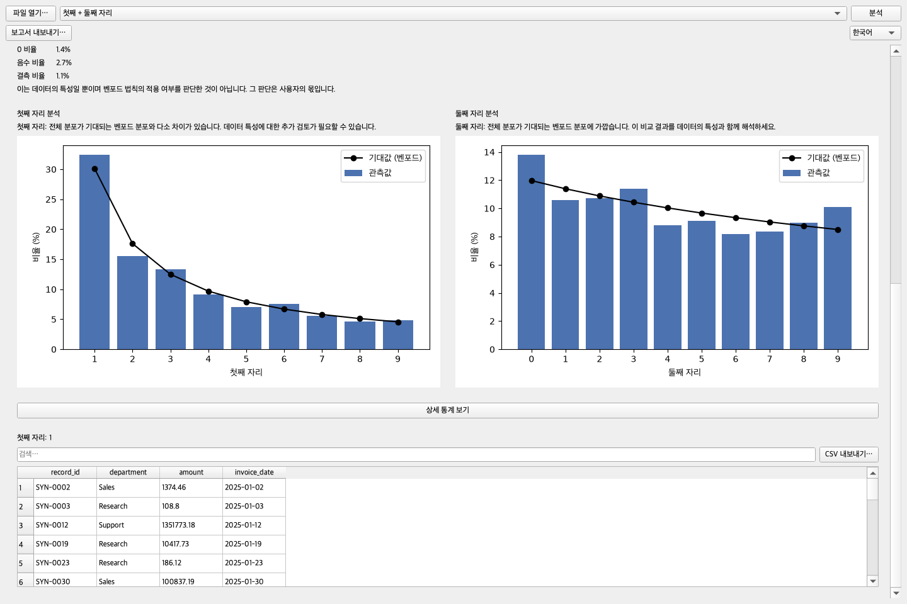
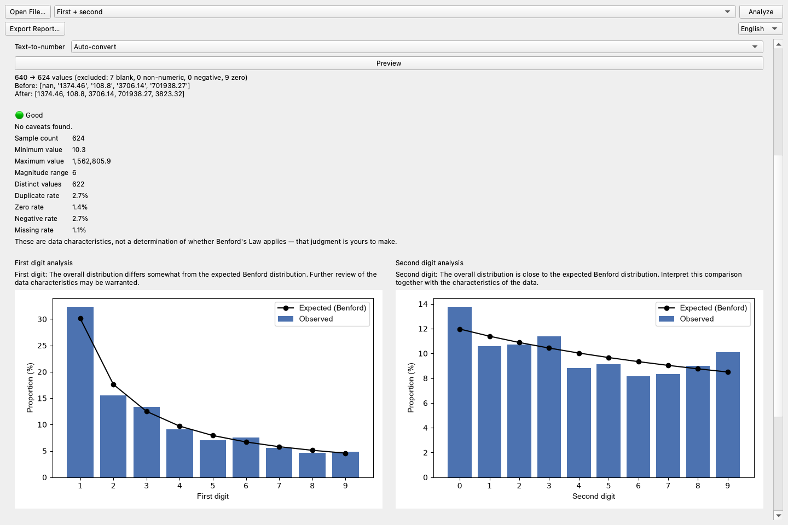

# Benford Lens — User Guide

[한국어](#한국어) · [English](#english)

## 한국어

### 1. 파일 열기

`파일 열기…`를 눌러 `.csv` 또는 `.xlsx` 파일을 선택합니다. Excel 파일에 시트가 여러 개면
불러올 시트를 사용자가 직접 고릅니다. 애플리케이션은 원본 파일을 수정하지 않습니다.

### 2. 분석 열 선택

표에 표시된 열을 클릭합니다. Benford Lens는 숫자로 보이는 열을 자동 선택하거나 자동 분석하지
않습니다. 금액, 수량처럼 자연스럽게 발생하고 여러 자릿수 범위에 걸친 값을 주로 검토하며,
ID·우편번호·고정 요율처럼 할당된 값은 그 특성을 먼저 고려합니다.

### 3. 전처리 확인

다음 옵션을 사용자가 직접 정할 수 있습니다.

| 옵션 | 선택 가능한 처리 |
|------|------------------|
| 음수 | 유지, 절댓값 변환, 제외 |
| 0 | 유지, 제외 |
| 소수 | 그대로, 반올림, 버림 |
| 빈 값 | 제외 |
| 중복 | 유지, 제외 |
| 문자형 숫자 | 자동 변환, 변환 안 함 |

`미리보기`는 처리 전후 개수, 제외된 값 수, 일부 예시를 보여 줍니다. 미리보기는 원본 파일을
바꾸지 않습니다.

### 4. 데이터 특성 읽기

열을 선택하면 표본 수, 최소/최대, 자릿수 범위, 고유 값 수, 중복률, 0/음수/결측 비율을
확인할 수 있습니다. 🟢/🟡/🔴 표시는 검토 편의를 위한 요약이며, 벤포드 법칙 적용 여부를
결정하지 않습니다.

### 5. 분석 모드 선택과 실행

- **첫째 자리:** 1–9의 첫 유효 숫자 분포
- **둘째 자리:** 0–9의 두 번째 유효 숫자 분포
- **첫째 + 둘째 자리:** 두 독립 결과를 같은 분석 스냅샷에서 함께 표시

모드를 고르고 `분석`을 누릅니다. 막대는 관측 비율, 선은 벤포드 기대 비율입니다. 요약 문구는
비교 결과를 설명하지만 자동 결론을 내리지 않습니다.

### 6. 상세 통계 확인

`상세 통계 보기`에서 MAD, 카이제곱 통계량과 p-value, KS 통계량과 p-value, 표본 수를 확인할
수 있습니다. 결합 모드에서는 MAD/카이제곱을 자릿수별로, 로그 가수 KS를 한 번만 보여 줍니다.
이 값들은 참고 정보이며 데이터의 생성 과정과 표본 특성을 함께 고려해야 합니다.

### 7. 원본 행 드릴다운

차트의 숫자를 클릭하면 해당 첫째 또는 둘째 자리를 가진 원본 행이 아래 표에 표시됩니다. 검색은
모든 열의 일반 부분 문자열을 대상으로 하며, `CSV 내보내기…`는 현재 행을 사용자가 선택한 새
경로에 저장합니다.

### 8. HTML 보고서 저장

분석 후 `보고서 내보내기…`를 눌러 별도 `.html` 경로를 선택합니다. 보고서는 분석 당시의 불변
스냅샷에서 생성되므로 전처리 요약, 데이터 특성, 차트, 통계가 같은 분석을 설명합니다. 직접 PDF
생성은 현재 범위에 포함되지 않습니다.

### 안전한 사용 원칙

- 민감한 파일은 계속 로컬에 두고 내보내기 위치의 접근 권한도 확인합니다.
- 원본 파일은 별도로 보존됩니다. 내보낸 CSV/HTML만 사용자가 선택한 위치에 생성됩니다.
- 데이터가 어떤 과정으로 생성됐는지 아는 사람이 결과를 맥락과 함께 해석해야 합니다.

---

## English

### 1. Open a file

Choose `Open File…` and select a `.csv` or `.xlsx` file. If a workbook contains several sheets,
you explicitly choose which one to load. The application does not modify the source file.

### 2. Choose a column

Click a row in the column table. Benford Lens never auto-selects or auto-analyzes a
numeric-looking column. Naturally occurring amounts or quantities spanning several magnitudes
may be worth exploring; assigned identifiers, postal codes, and fixed rates require different
context.

### 3. Review preprocessing

You explicitly configure negative, zero, decimal, blank, duplicate, and text-to-number handling.
`Preview` shows before/after counts, exclusion counts, and sample values without changing the
source file.

| Option | Available handling |
|--------|--------------------|
| Negative | Keep, absolute value, exclude |
| Zero | Keep, exclude |
| Decimal | As-is, round, truncate |
| Blank | Exclude |
| Duplicate | Keep, exclude |
| Text number | Auto-convert, do not convert |

### 4. Read the data characteristics

The context panel reports sample count, minimum/maximum, magnitude range, distinct values, and
duplicate/zero/negative/missing rates. Its 🟢/🟡/🔴 summary supports review but does not decide
whether Benford's Law applies.

### 5. Choose a mode and analyze

- **First digit:** first significant digit, 1–9
- **Second digit:** second significant digit, 0–9
- **First + second:** both independent results from the same analysis snapshot

Choose the mode and click `Analyze`. Bars show observed proportions and the line shows expected
Benford proportions. Summary text describes the comparison without making an automatic
conclusion.

### 6. Open reference statistics

`Show Details` reveals MAD, Chi-square statistic/p-value, KS statistic/p-value, and sample size.
Combined mode presents MAD/Chi-square by position and the shared log-mantissa KS result once.
These values are reference information and should be interpreted with the data-generation and
sample context.

### 7. Drill down to original rows

Click a digit in either chart to show matching original rows. Search performs a plain substring
match across all columns. `Export CSV…` writes the current rows only to a new destination that
you select.

### 8. Save an HTML report

After analysis, choose `Export Report…` and a separate `.html` destination. The report is built
from the analysis snapshot, so preprocessing, data context, charts, and statistics describe the
same run. Direct PDF generation is outside the current scope.

### Safe-use principles

- Keep sensitive files local and review access permissions for export destinations.
- The source remains unchanged; only requested CSV/HTML exports are created.
- Results should be interpreted in context by someone who understands how the data was produced.
